---
output:
  xaringan::moon_reader:
    seal: false
    css: [default,metropolis-fonts,custom.css,bootstrap.min.css]
    lib_dir: libs
    nature:
      highlightStyle: github
      highlightLines: true
      countIncrementalSlides: false
      ratio: '16:9'
      beforeInit: "./macros.js"
---


```{r setup, include=FALSE}
require(knitr)
require(kableExtra)
require(tidyverse)
options(kableExtra.latex.load_packages = FALSE)
options(knitr.table.format = "html")
options(htmltools.dir.version = FALSE)
library(RefManageR)
BibOptions(check.entries = FALSE, bib.style = "authoryear", style = "markdown",
           dashed = TRUE)
file.name <- "biblio.bib"
bib <- ReadBib(file.name)
library(knitr)  
library(reticulate)  
knitr::knit_engines$set(python = reticulate::eng_python)  

library(Matrix)
library(GenomicRanges)
library(HiTC)
library(patchwork)
```


class: center, middle
background-image: url(imgs/LOGO-bigA-3101.jpg),url(imgs/cbi.png),url(imgs/logo_UT3_RVB.png)
background-position: 100% 0%,25% 100%,75% 100%
background-size: 28%,15%,20%

## .center[__Group Meeting bigA__]

### .center[Studying 3D DNA conformation with __Hi-C__.]

<hr />

.large[Vincent ROCHER | bigA | 03/02/2022]


---

.pull-left[
## `r icons::icon_style(icons::fontawesome("laptop-code", style = "solid"), scale = 1, fill = "#27ae60")` Biologist-friendly 

* Omic data.
* HiC pipelines.
* HiC visualisation. 

]
.pull-right[
```{r out.width = '70%',echo=F}

```
]

--

.pull-left[
## `r icons::icon_style(icons::fontawesome("laptop-code", style = "solid"), scale = 1, fill = "#e74c3c")` Bioinfo-friendly

* Code details.
* Statistical/Algorithmic stuffs.
]
.pull-right[
```{r out.width = '70%',echo=F}
knitr::include_graphics("imgs/20120801012312I.png")
```
]


---

## `r icons::icon_style(icons::fontawesome("laptop-code", style = "solid"), scale = 1, fill = "#27ae60")` HiC capture the chromosome conformation within the nucleus
<br>
<br>
.center[
```{r out.width = '80%',echo=F}
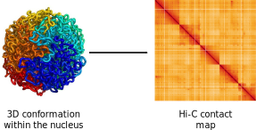
```

]

---

## `r icons::icon_style(icons::fontawesome("laptop-code", style = "solid"), scale = 1, fill = "#27ae60")` HiC capture the chromosome conformation within the nucleus
<br>
<br>
.center[
```{r out.width = '80%',echo=F}
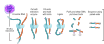
```

#### `r Citep(bib, "rao20143d")`

]

---

## `r icons::icon_style(icons::fontawesome("laptop-code", style = "solid"), scale = 1, fill = "#27ae60")` HiC capture the chromosome conformation within the nucleus
<br>
<br>
.center[
```{r out.width = '80%',echo=F}
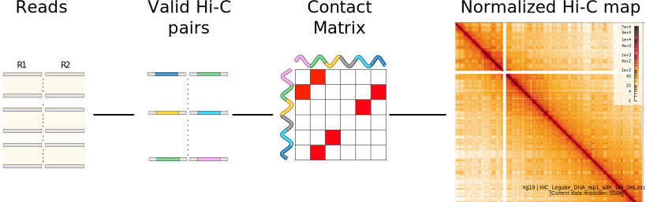
```

#### Hi-C mapping to Hi-C interaction map `r Citep(bib, "durand2016juicer")`

]

---

## `r icons::icon_style(icons::fontawesome("laptop-code", style = "solid"), scale = 1, fill = "#27ae60")` HiC capture the chromosome conformation within the nucleus

.center[
```{r out.width = '80%',echo=F}
knitr::include_graphics("imgs/HiC_landscape.svg")
```

#### Key 3D features of chromatin folding can be visualized with multiple resolutions 

#### `r Citep(bib, "kempfer2020methods")`
#### `r Citep(bib, "arnould2021loop")`

]


---

## `r icons::icon_style(icons::fontawesome("laptop-code", style = "solid"), scale = 1, fill = "#27ae60")` Where to find public HiC data

* [GEO](https://www.ncbi.nlm.nih.gov/geo/) / [ArrayExpress](https://www.ebi.ac.uk/arrayexpress/).
* [UCSC](https://genome.ucsc.edu/).
* [4DN Data Portal](https://data.4dnucleome.org/).
* 3D genome browsers ([JuiceBox](https://www.aidenlab.org/juicebox/) / [HiGlass](http://higlass.io/)).


.center[
```{r,echo=F}
knitr::include_url('https://data.4dnucleome.org/',height="400px")
```

]

---
## `r icons::icon_style(icons::fontawesome("laptop-code", style = "solid"), scale = 1, fill = " #27ae60")` Variations of Hi-C methods

* Micro-C/DNase Hi-C
  * Using either MNase or DNase instead of restriction enzymes.
* Capture Hi-C (promoter/custom).
* HiChIP (Hi-C + ChIP-seq).
* 4C-seq (One _locus_ against all).


---
## `r icons::icon_style(icons::fontawesome("laptop-code", style = "solid"), scale = 1, fill = "#27ae60")` Hi-C technologies 

### [Arima genomic](https://arimagenomics.com/) kits

* Hi-C using restriction enzymes.
* Hi-C/ChIP-seq using restriction enzymes (Hi-ChIP).
* Promoter/Custom Capture-HiC.


### [Dovetail Genomics](https://dovetailgenomics.com/) kits

* Hi-C using restriction enzymes.
* Hi-C using MNase (Micro-C).
* Hi-C/ChIP-seq using MNase (Hi-ChIP).
* "Targeted Enrichment Panels" Hi-C (Capture-HiC).

---

## `r icons::icon_style(icons::fontawesome("laptop-code", style = "solid"), scale = 1, fill = " #27ae60")` Hi-C resolution


.center[

| Study                           | Organism     | Number of reads | Resolution |
|---------------------------------|--------------|-----------------|------------|
| Lieberman-Aiden et al. 2009     | Human        | 30M             | 1 mb       |
| Sexton et al. 2012              | Drosophila   | 362.7M          | 10 kb      |
| Dixon et al. 2012               | Human, mouse | 806.1M          | 40 kb      |
| Jin et al. 2013                 | Human        | 2.9B            | 5 kb       |
| Rao et al. 2014                 | Human, mouse | 6.5B            | 950 bp     |

#### `r Citep(bib, "pal2019hi")`

]

>  [Arima Genomics:](https://arimagenomics.com/faqs/#:~:text=Each%20Arima%2DHiC%2B%20kit%20contains,~600M%20raw%20read%2Dpairs.) For a mammalian genome of 3 Gb, we recommend sequencing two biological replicates per biological condition. For high-resolution analysis of A/B compartments, topologically associating domains (TADs), and chromatin loops, the desired read depth is >600 million paired-end reads for each replicate.  For shallow sequencing used in library QC, we recommend at least 1 million paired-end reads. 


---

## `r icons::icon_style(icons::fontawesome("laptop-code", style = "solid"), scale = 1, fill = " #27ae60")` Hi-C running time

### .red[Hi-C processing and analysis are expensive]

* High resolution Hi-C reads cannot be aligned on a personal computer.
* For `50Go` of reads (~500 million pairs) : 
  * Alignment (`bwa mem`) running time (16 threads) : ~7h
  * ~`400Go` of output files (`Juicer`).
  * ~`1.5To` of temporary files.


---

## `r icons::icon_style(icons::fontawesome("laptop-code", style = "solid"), scale = 1, fill = " #e74c3c")` HiC pipelines

### Juicer

`juicer.sh -t 12 -d /HiC -z genome.fa -p chrom.sizes -y restriction_enzyme.txt -s DpnII`

* JuicerTools `r Citep(bib, "durand2016juicer")`
* Output a `.hic` file (non human readable)
* (ENCODE project use their own custom Juicer pipeline)[https://github.com/ENCODE-DCC/hic-pipeline].

### distiller (previously hiclib)

`nextflow run distiller.nf -params-file config.yml`

* distiller pipeline: [](https://doi.org/10.5281/zenodo.3350937)
* Output a `.mcool` file (non human readable)

#### `config.yml/.txt` will contain chromosome sizes, reference genome, which digestion enzyme is used ....

---

## `r icons::icon_style(icons::fontawesome("laptop-code", style = "solid"), scale = 1, fill = " #e74c3c")` HiC pipelines

### HiC-pro

`HiC-Pro -p 12 -i /HiC -o /OUT -c config.txt`

* HiC-Pro `r Citep(bib, "servant2015hic")`
* Output contact maps as a triplet sparse format : `bin_i / bin_j / counts_ij`
* Exist as Nextflow pipeline:

`nextflow run nf-core/hic --input '*_R{1,2}.fastq.gz' -profile docker --genome 'hg19' --digestion 'dnpii'`

#### `config.yml/.txt` will contain chromosome sizes, reference genome, which digestion enzyme is used ....


---

### `r icons::icon_style(icons::fontawesome("laptop-code", style = "solid"), scale = 1, fill = " #27ae60")` Collaboration network of top 70 labs in 3D Genome from years 2017-2021

.center[
```{r out.width = '80%',echo=F,fig.cap="https://github.com/XiaoTaoWang/Best-Labs-of-3D-Genome"}
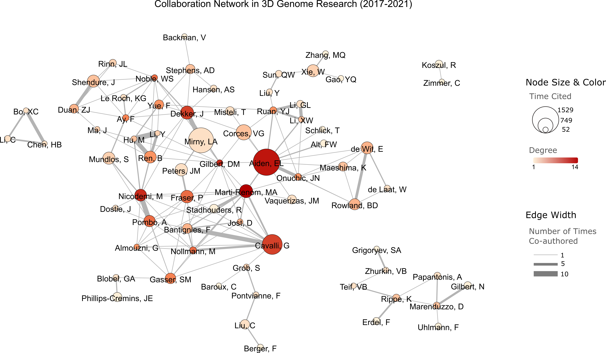
```
]


---
class: split-40
## `r icons::icon_style(icons::fontawesome("laptop-code", style = "solid"), scale = 1, fill = " #f39c12")` HiC mapping strategy


.center[
```{r out.width = '50%',echo=F,fig.cap="TADbit mapping strategy. https://3dgenomes.github.io/TADbit/tutorial/tutorial_4-Mapping.html"}
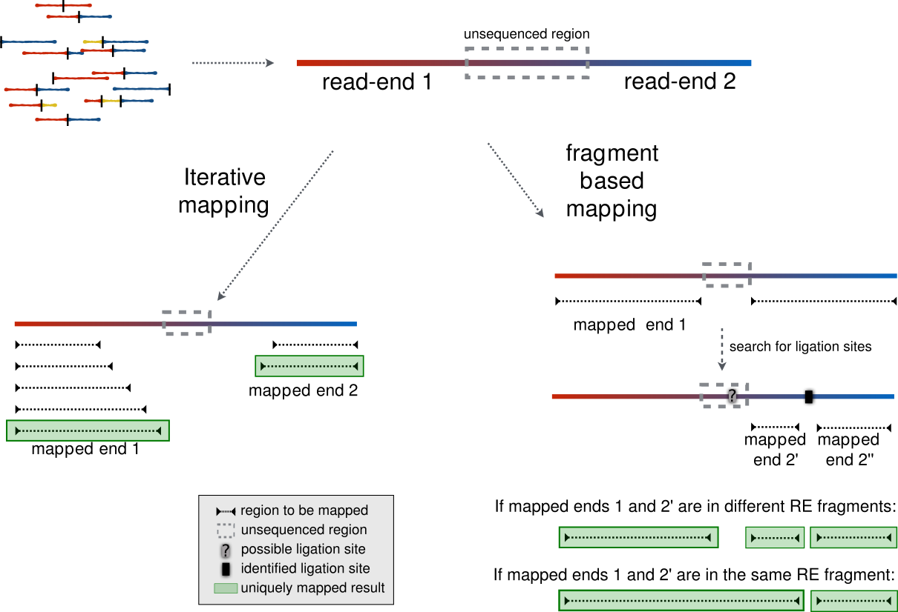
```
]

1. Iterative mapping `r Citep(bib, "imakaev2012iterative")`.

2. Split mapping.  

3. Pre-truncating reads `r Citep(bib, c("ay2015analysis","wingett2015hicup"))`.

4. Fragment-based `r Citep(bib, c("serra2017automatic"))`.


---
## `r icons::icon_style(icons::fontawesome("laptop-code", style = "solid"), scale = 1, fill = " #e74c3c")` HiC mapping strategy

## Iterative mapping

### FanC (`python`)

`fanc.map.iterative_mapping(min_size=15, step_size=10)`

* `min_size` determines the minimum size of a truncated read.
* `step_size` determines the truncation amount.

### TADbit (`python`)

```python
from pytadbit.mapping.full_mapper import full_mapping
full_mapping(frag_map=False,windows=((1,25),(1,35),(1,45),(1,55),(1,65),(1,75)))
```

* `frag_map=False`: Disable fragment-based mapping.
* By setting `frag_map=True` and `windows`, you can do combination of both mapping strategies.

> Iterative mapping has to be run twice, independently for each `FASTQ` file.


---
## `r icons::icon_style(icons::fontawesome("laptop-code", style = "solid"), scale = 1, fill = " #e74c3c")` HiC mapping strategy

### Fragment-based mapping Using `bowtie2`

#### Mapping full-length reads first (independant mapping of `R1`/`R2`)

```bash
bowtie2 --un unmapped.fastq --end-to-end -x genome.fa -U read1.fastq | samtools view -bS - > mapped.bam
```

#### reads spanning the ligation junction are trimmmed from their 3’ ....

```bash
cutsite_trimming --fastq unmapped.fastq --cutsite GATCGATC --out trimmed.fastq
```

                        R1                            R2
        ***************>                        <************              
       |--------|---------------------------------------------|
            A                            B              

                        R1                            R2
        *******>                                 <************              
       |--------|---------------------------------------------|
            A                            B              
#### ... And aligned back on the genome, then merged

```bash
bowtie2 --end-to-end -U trimmed.fastq | samtools view -bS - > trimmed.bam
samtools merge mapped.bam trimmed.bam
```

#### Tools using bowtie2

* `hicup` (`pre-truncating`)
* `HiC-Pro` (`fragment-based`)


---


## `r icons::icon_style(icons::fontawesome("laptop-code", style = "solid"), scale = 1, fill = " #e74c3c")` HiC mapping strategy

### Split mapping Using `bwa`

```bash
bwa mem -5SPM genome.fa read1.fastq read2.fastq | samtools view -Shb - > mapped.bam
```

from [Hi-C Processing Pipeline](https://data.4dnucleome.org/resources/data-analysis/hi_c-processing-pipeline):


* The `-SP` option is used to ensure the results are equivalent to that obtained by running bwa mem on each mate separately, while retaining the right formatting for paired-end reads. 
* The `-5` option is used to report the 5' portion of chimeric alignments as the primary alignment.
* The `-M` option is used to annotate the secondary/supplementary clipped reads as secondary rather than supplementary, for compatibility with some public software tools such as picard MarkDuplicates.


> version 0.7.17 or higher is required for the -5 option for Hi-C data

#### Tools using bwa:

* `Juicer`.
* `distiller` (previously `hiclib`).


---
## `r icons::icon_style(icons::fontawesome("laptop-code", style = "solid"), scale = 1, fill = " #27ae60")` Post-mapping strategy

### Many tools use custom scripts to convert aligned files (`bam`) into  pairs of interactions.

#### One example (`Juicer`):

```bash
head merged_nodups.txt
16 chr1 10617 0 16 chr1 114351057 294013 7 82M TACCACCGAAATCTGTGCAGAGGAGAACGCAGCTCCGCCCTCGCGGTGCTCTCCGGGTCTGTGCTGAGGAGAACGCAACTCC 60 82M GTGACAAGAAAAAAAAAGTCTGCACAAGTCCAGTACAGACAATGTTTTTTTGAAAATATTTTCAATCCCAGGTTGGCTGAAT NB501764:828:HTGLNBGXB:2:21307:2364:14969$/HiC/splits/HiC_rep1.fastq.gz$400960048 NB501764:828:HTGLNBGXB:2:21307:2364:14969$/HiC/splits/HiC_rep1.fastq.gz$400960049 
0 chr1 13279 5 16 chr1 13512 7 11 82M CACCCGGCACCCTGTCCTGGACACGCTGTTGGCCTGGATCTGAGCCCTGGTGGAGGTCAAAGCCACCTTTGGTTCTGCCATT 6 82M TCACTGCCTTTTGTCTGCCCAGTTTCACCAGAAGTAGGCCTCTTCCTGACAGGCAGCTGCACCACTGCCTGGCGCTGTGCCC NB501764:828:HTGLNBGXB:3:12608:10576:14532$/HiC/splits/HiC_rep1.fastq.gz$570258508 NB501764:828:HTGLNBGXB:3:12608:10576:14532$/HiC/splits/HiC_rep1.fastq.gz$570258509 

```

#### HiC-pro use a similar format (`.validPairs`).

### `r icons::icon_style(icons::fontawesome("exclamation-triangle", style = "solid"), scale = 2, fill = "red")` <span style="color:red">One custom method by tools = BAD.</span>

---

## `r icons::icon_style(icons::fontawesome("laptop-code", style = "solid"), scale = 1, fill = " #27ae60")` Post-mapping strategy


### Solution : `pairtools`

Process Hi-C pairs with `pairtools` [](https://doi.org/10.5281/zenodo.1490831)

From [Documentation:](https://pairtools.readthedocs.io/en/latest/)

`pairtools` aim to be an all-in-one tool for processing Hi-C pairs, and 
can produce .pairs files compliant with the 
[4DN standard](https://github.com/4dn-dcic/pairix/blob/master/pairs_format_specification.md). (Not so hard because they are the same guys).

---
## `r icons::icon_style(icons::fontawesome("laptop-code", style = "solid"), scale = 1, fill = " #27ae60")` Post-mapping strategy

### Aligned files (`bam`) to valid pairs of interactions with `pairtools`

`pairtools` produce and operate on tab-separated files compliant with the
[.pairs](https://github.com/4dn-dcic/pairix/blob/master/pairs_format_specification.md) 
format defined by the [4D Nucleome Consortium](https://www.4dnucleome.org/). All
pairtools properly manage file headers and keep track of the data
processing history.


> `r icons::icon_style(icons::fontawesome("exclamation-triangle", style = "solid"), scale = 3, fill = "red")` <span style="color:red;font-size: 150%">Pairs format is a standard text format for pairs of ligation junctions (not binned).</span>

.center[
```{r out.width = '60%',echo=F,fig.cap="https://pairtools.readthedocs.io/en/latest/parsing.html"}
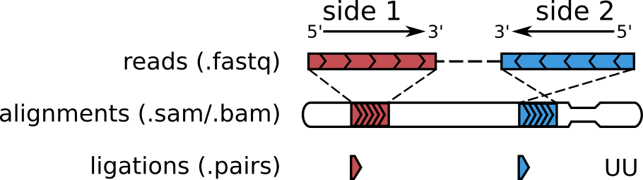
```
]


---
## `r icons::icon_style(icons::fontawesome("laptop-code", style = "solid"), scale = 1, fill = " #27ae60")` Post-mapping strategy

### Aligned files (`bam`) to valid pairs of interactions with `pairtools`

`pairtools parse` detects ligation events in the aligned sequences of DNA molecules formed in Hi-C experiments and reports them in the .pairs/.pairsam format.

### Example pairs file
```
## pairs format v1.0
#sorted: chr1-chr2-pos1-pos2
#shape: upper triangle
#genome_assembly: hg38
#chromsize: chr1 249250621
#chromsize: chr2 243199373
#chromsize: chr3 198022430
...
#columns: readID chr1 pos1 chr2 pos2 strand1 strand2
EAS139:136:FC706VJ:2:2104:23462:197393 chr1 10000 chr1 20000 + +
EAS139:136:FC706VJ:2:8762:23765:128766 chr1 50000 chr1 70000 + +
EAS139:136:FC706VJ:2:2342:15343:9863 chr1 60000 chr2 10000 + +
EAS139:136:FC706VJ:2:1286:25:275154 chr1 30000 chr3 40000 + -
```
---

## `r icons::icon_style(icons::fontawesome("laptop-code", style = "solid"), scale = 1, fill = " #27ae60")` Post-mapping strategy

### `pairtools parse`: How it works
<br>
<br>
### 1. when each side has only one unique alignment: `UU` as unique-unique.

.center[
```{r out.width = '70%',echo=F,fig.cap="https://pairtools.readthedocs.io/en/latest/parsing.html"}

```
]


---

## `r icons::icon_style(icons::fontawesome("laptop-code", style = "solid"), scale = 1, fill = " #27ae60")` Post-mapping strategy

### `pairtools parse`: How it works
<br>
<br>
### 2. Unmapped reads: `NU` (null-unique) or `NN` (null-null).

.center[
```{r out.width = '70%',echo=F,fig.cap="https://pairtools.readthedocs.io/en/latest/parsing.html"}

```
]

---

## `r icons::icon_style(icons::fontawesome("laptop-code", style = "solid"), scale = 1, fill = " #27ae60")` Post-mapping strategy

### `pairtools parse`: How it works
<br>
<br>
### 3. Multimapped reads: `MU` (multi-unique) or `MM` (multi-multi) or `NM` (null-multi).

.center[
```{r out.width = '70%',echo=F,fig.cap="https://pairtools.readthedocs.io/en/latest/parsing.html"}
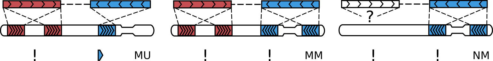
```
]

---

## `r icons::icon_style(icons::fontawesome("laptop-code", style = "solid"), scale = 1, fill = " #27ae60")` Post-mapping strategy

### `pairtools parse`: How it works
<br>
<br>
### 4. Multiple ligations (walks): `WW` (walk-walk).

.center[
```{r out.width = '70%',echo=F,fig.cap="https://pairtools.readthedocs.io/en/latest/parsing.html"}
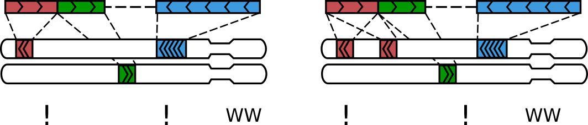
```
]

---

## `r icons::icon_style(icons::fontawesome("laptop-code", style = "solid"), scale = 1, fill = " #27ae60")` Post-mapping strategy

### `pairtools parse`: How it works

### Rescuing complex ligations

.center[
```{r out.width = '50%',echo=F,fig.cap="https://pairtools.readthedocs.io/en/latest/parsing.html"}
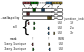
```
]


* `pairtools parse` detects such molecules and rescues them with `--walks-policy all`.
* `--walks-policy=5unique` to report the 5’-most unique alignment on each side.

---
## `r icons::icon_style(icons::fontawesome("laptop-code", style = "solid"), scale = 1, fill = " #27ae60")` Post-mapping strategy

### `pairtools parse`: How it works
<br>
<br>
### Rescuing single ligations

Cases in which three alignments in read pairs are the result of one ligation event.

.center[
```{r out.width = '35%',echo=F,fig.cap="https://pairtools.readthedocs.io/en/latest/parsing.html"}
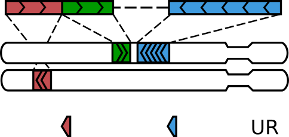
```
]

> Single ligations are the "chimeric" reads on `Juicer`. 

---

## `r icons::icon_style(icons::fontawesome("laptop-code", style = "solid"), scale = 1, fill = " #27ae60")` Post-mapping strategy

###  `pairtools` is like `samtools` but for Hi-C data:

- detect ligation junctions (a.k.a. Hi-C pairs) in aligned paired-end sequences of Hi-C DNA molecules
  - __Main goal__ : pairs of `reads` into pairs of interactions.
- sort .pairs files for downstream analyses.
- detect, tag and remove PCR/optical duplicates.
- generate extensive statistics of Hi-C datasets.
- select Hi-C pairs given flexibly defined criteria `pairtools select '(pair_type=="UU") or (pair_type=="UR")'`:
  - Only the reads with pairtools classification `UU`/`UR` can be retained and output to a pairs file.
- restore `.sam` alignments from Hi-C pairs (`.pairsam`).


---

## `r icons::icon_style(icons::fontawesome("laptop-code", style = "solid"), scale = 1, fill = " #27ae60")` Post-mapping strategy


## Summary (`Juicer`)

```{bash,eval=F}
Sequenced Read Pairs:  525,674,984
 Normal Paired: 352,728,492 (67.10%) #<<  
 Chimeric Paired: 96,761,172 (18.41%) #<<  
 Collisions: 4,044,014 (0.77%)
 Low MAPQ Collisions: 1,046,192 (0.20%)
 Unmapped: 9,685,537 (1.84%)
 MAPQ 0: 61,409,577 (11.68%)
 Ligation Motif Present: 150,571,084 (28.64%)
Alignable (Normal+Chimeric Paired): 449,489,664 (85.51%) #<<  
Unique Reads: 437,379,081 (83.20%)
PCR Duplicates: 11,975,333 (2.28%)
Optical Duplicates: 135,250 (0.03%)
Library Complexity Estimate: 8,280,178,040
Intra-fragment Reads: 17,552,902 (3.34% / 4.01%)
Hi-C Contacts: 419,826,179 (79.86% / 95.99%)
 Ligation Motif Present: 116,386,607  (22.14% / 26.61%)
 3' Bias (Long Range): 65% - 35%
 Pair Type %(L-I-O-R): 25% - 25% - 25% - 25%
Inter-chromosomal: 56,317,688  (10.71% / 12.88%)
Intra-chromosomal: 363,508,491  (69.15% / 83.11%)
Short Range (<20Kb): 152,231,938  (28.96% / 34.81%)
Long Range (>20Kb): 211,275,579  (40.19% / 48.30%)

```

#### __Legube Team__: Every HiC data for now are mapped using this strategy 

---

## `r icons::icon_style(icons::fontawesome("laptop-code", style = "solid"), scale = 1, fill = " #27ae60")` Post-mapping strategy

## Summary (From Juicer output `.bam`)


.pull-left[
### `pairtools` (83.69%)

```{bash,eval=F}
total	3785230
total_unmapped	50411
total_single_sided_mapped	566294
total_mapped	3168525
total_dups	0
total_nodups	3168525
cis	2739538
trans	428987
pair_types/uU	32827 #<<
pair_types/NR	8096
pair_types/nn	6
pair_types/Nu	410
pair_types/MM	42986
pair_types/mu	257
pair_types/Nm	20
pair_types/UU	2845217 #<<
pair_types/Uu	32529 #<<
pair_types/MR	115125
pair_types/nm	15
pair_types/MU	411166
pair_types/Mu	31210
pair_types/RU	128632 #<<
pair_types/mm	41
pair_types/UR	128658 #<<
pair_types/mM	3463
pair_types/nM	500
pair_types/uu	662 #<<
pair_types/Mm	3380
pair_types/nu	30
```
]


.pull-right[
### `Juicer` (85.86%)

```{bash,eval=F}
Sequenced Read Pairs:  4,408,745
 Normal Paired: 3,308,277 (75.04%) #<<
 Chimeric Paired: 476,953 (10.82%) #<<
 Collisions: 19,262 (0.44%)
 Low MAPQ Collisions: 4,937 (0.11%)
 Unmapped: 40,131 (0.91%)
 MAPQ 0: 559,185 (12.68%)
 Ligation Motif Present: 964,964 (21.89%)
Alignable (Normal+Chimeric Paired): 3,785,230 (85.86%) #<<
Unique Reads: 3,780,493 (85.75%)
PCR Duplicates: 4,316 (0.10%)
Optical Duplicates: 421 (0.01%)
Library Complexity Estimate: 1,658,235,280
Intra-fragment Reads: 143,455 (3.25% / 3.79%)
Hi-C Contacts: 3,637,038 (82.50% / 96.21%)
 Ligation Motif Present: 770,139  (17.47% / 20.37%)
 3' Bias (Long Range): 61% - 39%
 Pair Type %(L-I-O-R): 25% - 25% - 25% - 25%
Inter-chromosomal: 537,857  (12.20% / 14.23%)
Intra-chromosomal: 3,099,181  (70.30% / 81.98%)
Short Range (<20Kb): 1,331,348  (30.20% / 35.22%)
Long Range (>20Kb): 1,767,820  (40.10% / 46.76%)
```
]

---

## `r icons::icon_style(icons::fontawesome("laptop-code", style = "solid"), scale = 1, fill = " #f39c12")` Matrix aggregation ([source](https://data.4dnucleome.org/resources/data-analysis/hi_c-processing-pipeline))

.center[
```{r out.width = '65%',echo=F}
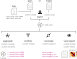
```
#### `r Citep(bib, "abdennur2020cooler")`
]


---
## `r icons::icon_style(icons::fontawesome("laptop-code", style = "solid"), scale = 1, fill = " #27ae60")` Matrix aggregation ([source](https://data.4dnucleome.org/resources/data-analysis/hi_c-processing-pipeline))


### `.hic` format

* A `.hic` file is produced by Juicertools (version `1.8.9-cuda8`) and can be visualized using Juicebox
* The matrix is normalized using the `VC`, `VC_SQRT`, `KR` methods, after filtering out intra-fragment contacts (contacts that fall in the same restriction fragment).

### `.mcool` format

* An `.mcool` file is produced by Cooler (version `0.8.3`) and can be visualized using HiGlass.
* The matrix is normalized using the `ICE` (iterative correction and eigenvalue decomposition) matrix balancing algorithm, after the matrix-level removal of the diagonal and the rows/columns with a low value.
* The `.mcool` file also contains the normalization vectors generated by Juicertools (same as in a .hic file generated from the same pairs file)

*  `.cool` format is very well [documented](https://cooler.readthedocs.io/en/latest/index.html).

### `r icons::icon_style(icons::fontawesome("exclamation-triangle", style = "solid"), scale = 2, fill = "red")` <span style="color:red">You want theses files to visualise HiC on Genome Browser.</span>


---
## `r icons::icon_style(icons::fontawesome("laptop-code", style = "solid"), scale = 1, fill = " #e74c3c")` Matrix aggregation

### `.hic` format

`.hic` are generated with `juicertools pre` command and accept different formats :

1. `Short`: `<str1> <chr1> <pos1> <frag1> <str2> <chr2> <pos2> <frag2>`
2. `Medium`: `<readname> <str1> <chr1> <pos1> <frag1> <str2> <chr2> <pos2> <frag2> <mapq1> <mapq2>`
3. `Long` (`Juicer` output): `<str1> <chr1> <pos1> <frag1> <str2> <chr2> <pos2> <frag2> <mapq1> <cigar1> <sequence1> <mapq2> <cigar2> <sequence2> <readname1> <readname2>`
4. `4DN DCIC format` (`.pair` output): `readID chr1 position1 chr2 position2 strand1 strand2`

```bash
java -Xmx48000m  -Djava.awt.headless=true -jar juicertools.jar pre --threads 12 mapped.pairs contact_map.hic chrom.sizes
```

---
## `r icons::icon_style(icons::fontawesome("laptop-code", style = "solid"), scale = 1, fill = " #e74c3c")` Matrix aggregation

### `.cool`/`.mcool` format

### Work with `Pairix`

[Pairix](https://github.com/4dn-dcic/pairix) is a tool for indexing and querying on a block-compressed text file containing pairs of genomic coordinates.


### Genereting single resolution contact map file (`.cool`)

```bash
bgzip mapped.pairs

pairix mapped.pairs.gz

cooler cload pairix -p 12 chrom.sizes:1000 mapped.pairs.gz contact_map_1kb.cool

```

### Genereting multi-resolutions contact map file (`.mcool`)

```bash
cooler zoomify --balance -p 12 contact_map_1kb.cool
```

* `--balance` will apply balancing (normalization) to each zoom level.
*  `cooler` can also work with pre-binned contact matrix (`cooler load`).

---

## `r icons::icon_style(icons::fontawesome("laptop-code", style = "solid"), scale = 1, fill = " #e74c3c")` Matrix aggregation

### Hi-C matrix conversion with `hicConvertFormat` from `HiCExplorer` ([source](https://hicexplorer.readthedocs.io/en/latest/content/tools/hicConvertFormat.html))

#### `.hic` to `.cool`

```bash
hicConvertFormat -m contact_map.hic --inputFormat hic --outputFormat cool -o contact_map_10kb.cool --resolutions 10000
```

#### `.hicpro` to `.cool`

```bash
hicConvertFormat -m matrix.hicpro --bedFileHicpro hicpro.bed --inputFormat hicpro --outputFormat cool -o matrix.cool
```


---
## `r icons::icon_style(icons::fontawesome("laptop-code", style = "solid"), scale = 1, fill = " #e74c3c")` Full Hi-C pipeline

### `bowtie2` (fragment-based)

.center[
```{r out.width = '55%',echo=F}
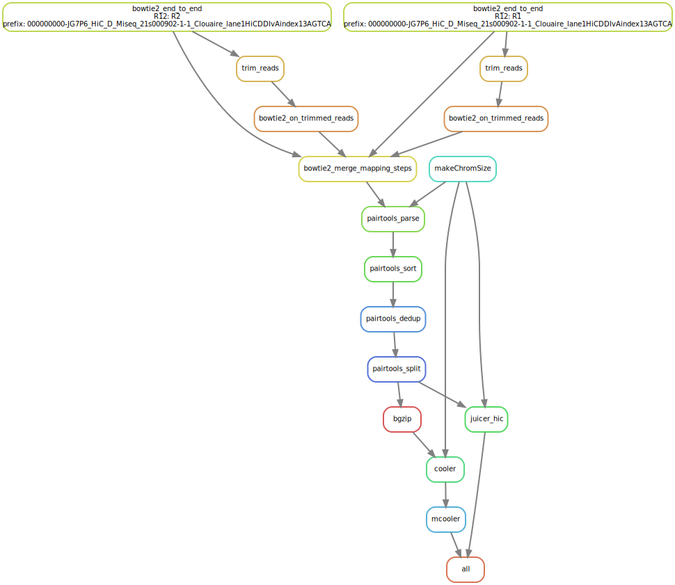
```
]

---
## `r icons::icon_style(icons::fontawesome("laptop-code", style = "solid"), scale = 1, fill = " #e74c3c")` Full Hi-C pipeline

### `bwa` (split mapping)

.center[
```{r out.width = '45%',echo=F}
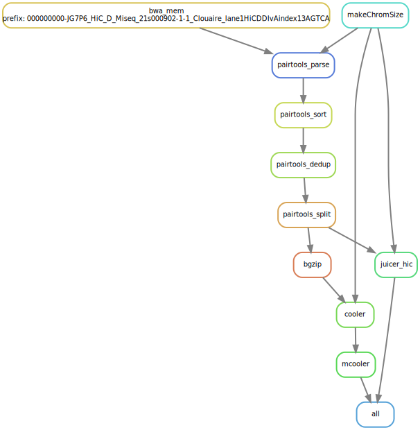
```
]

---
## `r icons::icon_style(icons::fontawesome("laptop-code", style = "solid"), scale = 1, fill = " #27ae60")` Variations of Hi-C methods

* Micro-C/DNase Hi-C
  * Using either MNase or DNase instead of restriction enzymes.
* Capture Hi-C (promoter/custom).
* HiChIP (Hi-C + ChIP-seq).
* 4C-seq (One _locus_ against all).

### Some Hi-C pipelines works with Hi-C variations

* `distiller` works just fine.
* Some other tools aren't as good : 
  * `HiC-pro` can work without restriction enzyme with `LIGATION_SITE` `GENOME_FRAGMENT` unseted.
  * `Juicer` want a restriction enzyme file to work (need to be tested).


### Specific tools

* Capture Hi-C:
  * [`CHiCAGO`](https://bioconductor.org/packages/release/bioc/html/Chicago.html).
* HiChIP:
  * [HiChIP pipeline by Dovetail Genomics](https://hichip.readthedocs.io/en/latest/).
  * [`FitHiChIP`](https://github.com/ay-lab/FitHiChIP).
* 4C-seq:
  * [peakC](https://github.com/deWitLab/peakC).

---
## `r icons::icon_style(icons::fontawesome("laptop-code", style = "solid"), scale = 1, fill = " #27ae60")` Special features of Hi-C data


### __Hi-C normalization__: Sequence-dependant features introduce biais in Hi-C data

1. Explicit correction.
2. Implicit correction.
3. Joint normalization.

### __Observed/Expected__: Remove Expected to remove Polymer distance effect

> The strongest signal in a typical Hi-C map is the decay of contact frequency with genomic separation (also referred to as genomic distance). In the Hi-C field, this decay is often interchangeably referred to as the:

>* expected because one "expects" a certain average contact frequency at a given genomic separation.
>* scaling which is borrowed from the polymer physics literature.
>* $P(s)$ curve contact probability, $P$, as a function of genomic separation, $s$.
>
> __Source__: https://cooltools.readthedocs.io/en/latest/notebooks/contacts_vs_distance.html


---
## `r icons::icon_style(icons::fontawesome("laptop-code", style = "solid"), scale = 1, fill = " #f39c12")` Hi-C Matrix normalization ([Source](https://genomebiology.biomedcentral.com/articles/10.1186/s13059-015-0745-7))

### Explicit correction

Correction using _a priori_ knowledge of the factors that may cause bias in Hi-C data:

* Known bias : GC content, mapability, fragment length.
* (Some) Tools using Explicit correction: 
  * [`HiCorr`](https://github.com/JinLabBioinfo/HiCorr) (`Perl`/`Python`/`Shell`).
  * [`HiCNorm`](https://github.com/ren-lab/HiCNorm) (`R`).

---
## `r icons::icon_style(icons::fontawesome("laptop-code", style = "solid"), scale = 1, fill = " #f39c12")` Hi-C Matrix normalization ([Source](https://genomebiology.biomedcentral.com/articles/10.1186/s13059-015-0745-7))


### Matrix balancing

* Matrix balancing assume equal visibility for all _loci_ (`==rowsum`).
* This method is based on the assumption that each locus should have the same probability of interaction genome-wide.
* Should correct for any bias in the contact maps.
* Many methods: `VC`,`ICE`,`KR`.
* (Some) Tools using Matrix balancing:
  * `Juicer` (`KR`,`VC`).
  * `Cooler` (`ICE`).
  * `HiC-Pro` (`ICE`).

> Issues with cancer data. See [LOIC/CAIC](https://github.com/nservant/cancer-hic-norm) normalization.
  
> Matrix balancing is the most common normalization since  `Juicer`, `Cooler` and `HiC-Pro` use it.
  
---
## `r icons::icon_style(icons::fontawesome("laptop-code", style = "solid"), scale = 1, fill = " #f39c12")` Hi-C Matrix normalization ([Source](https://genomebiology.biomedcentral.com/articles/10.1186/s13059-015-0745-7))

### Joint correction

Joint correction allows for visualizing the differences between interacting chromatin regions in two Hi-C datasets while explicitly accounting for the linear distance between interacting regions.

* Used to compare multiples Hi-C dataset
* (Some) Tools using Joint correction:
  * [`multiHiCcompare`](https://bioconductor.org/packages/release/bioc/html/multiHiCcompare.html)/[`HiCcompare`](https://bioconductor.org/packages/release/bioc/html/HiCcompare.html).
  
> Hypothesis: Distance effect is not affected by the experiment.

---
## `r icons::icon_style(icons::fontawesome("laptop-code", style = "solid"), scale = 1, fill = " #f39c12")`Hi-C  Matrix normalization


.center[
```{r out.width = '70%',echo=F}
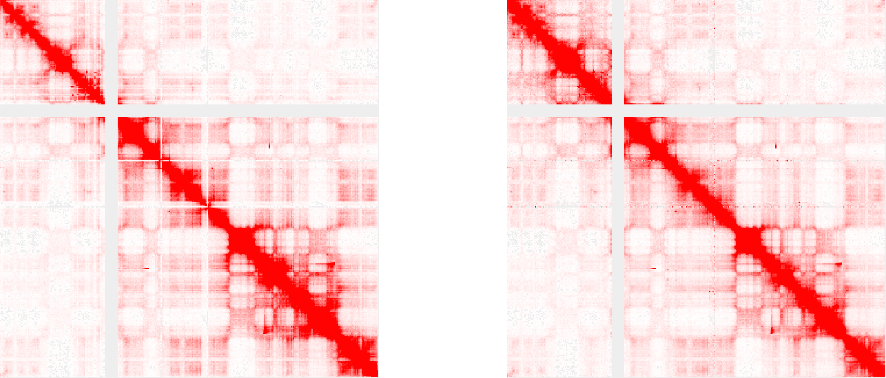
```

#### __Observed (raw)__ HiC data (_left_) vs __Observed (Matrix balancing)__ HiC data (_right_).

]

---
## `r icons::icon_style(icons::fontawesome("laptop-code", style = "solid"), scale = 1, fill = " #f39c12")` Hi-C Matrix transformation

.center[
```{r out.width = '70%',echo=F}
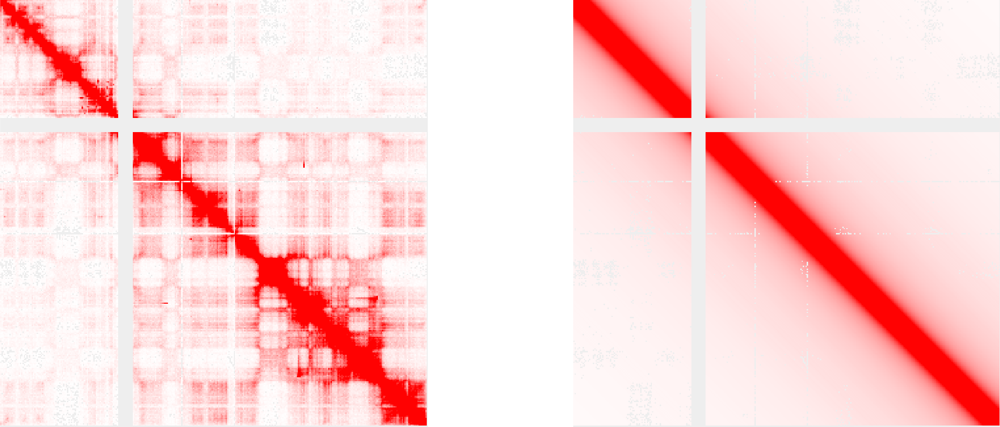
```

#### __Observed__ HiC data (_left_) vs __Expected__ HiC data (_right_).


]

* `Expected`: decay of contact frequency with genomic separation.
* (Some) tools to compute `Expected` matrix:
  * `juicertool dump`: `juicer_tools.jar dump expected`.
  * [HiTC](https://bioconductor.org/packages/release/bioc/html/HiTC.html) (`R` packages).
  * `expected_cis` from `cooltools`.
  * `expected_values()` from `FAN-C`

---
## `r icons::icon_style(icons::fontawesome("laptop-code", style = "solid"), scale = 1, fill = " #f39c12")` Hi-C Matrix transformation

.center[
```{r out.width = '90%',echo=F}
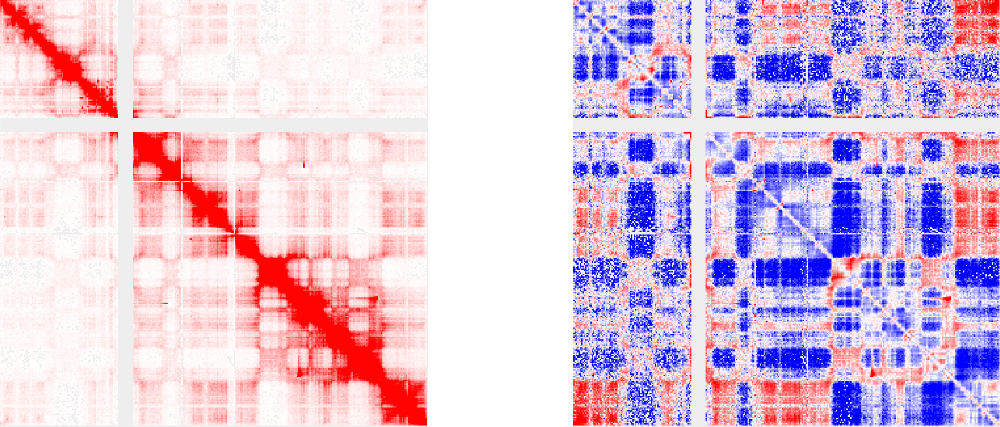
```

#### __Observed__ HiC data (_left_) vs __Observed/Expected__ HiC data (_right_).
]

* `Observed/Expected`: Remove genomic distance effect.
* Can be obtained by `juicertool dump`: `juicer_tools.jar dump OE`

> An expected level of interactions between disjoint chromosomes is calculated as a simple average, as there is no notion of genomic separation for a pair of chromosomes and contact matrix for these regions looks "flat".

---
## `r icons::icon_style(icons::fontawesome("laptop-code", style = "solid"), scale = 1, fill = " #f39c12")` Work with Hi-C data


.center[
```{r out.width = '100%',echo=F}

```
]

---

## `r icons::icon_style(icons::fontawesome("laptop-code", style = "solid"), scale = 1, fill = " #27ae60")` Visualization

### [Juicebox](http://www.aidenlab.org/juicebox/)

.center[
```{r out.width = '35%',echo=F}
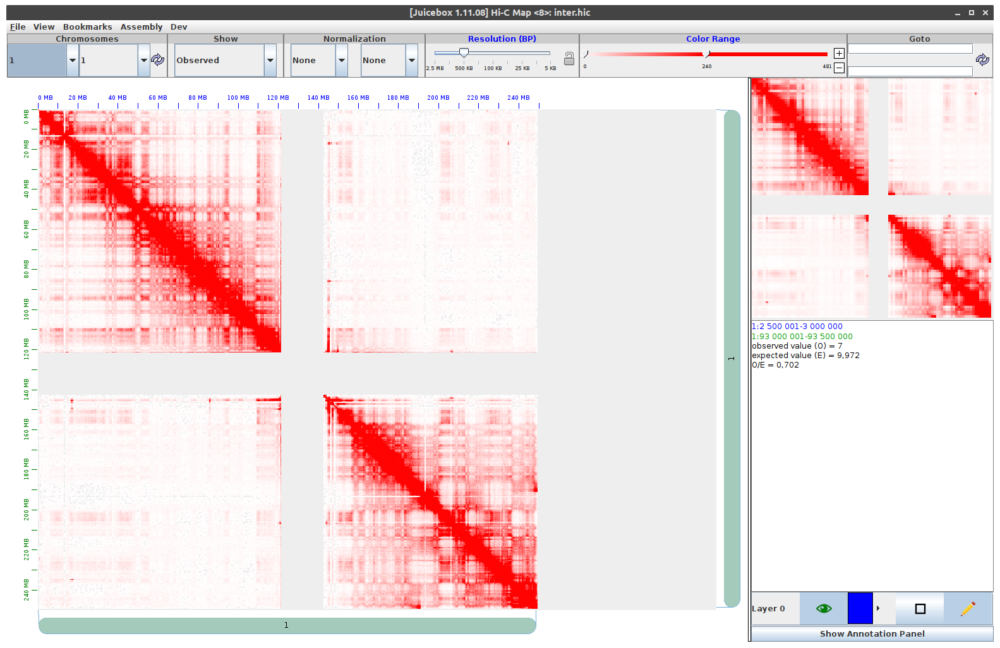
```
]

* Desktop version : https://github.com/aidenlab/Juicebox/wiki/Download (Java)
* Web version : http://www.aidenlab.org/juicebox/

* .green[__Pros__]: 
  * Very convenient to use.
  * Work with plenty of formats (`bigwig`,`bed`).
  * Many normalizations/transformations available for HiC data (Balanced/Expected/Pearson correlation).
* .red[__Cons__]:
  * Work only with `.hic` format.


---

## `r icons::icon_style(icons::fontawesome("laptop-code", style = "solid"), scale = 1, fill = " #27ae60")` Visualization


### [HiGlass](https://higlass.io/)

.center[
```{r out.width = '30%',echo=F}
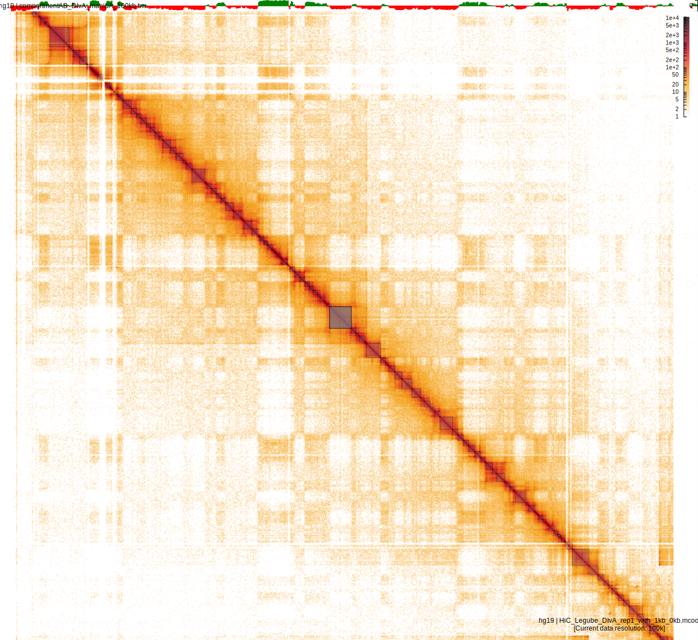
```
]

* .green[__Pros__]: 
  * Very beautiful and many features are available.
  * Python API (and jupyter) + JavaScript API.
* .red[__Cons__]:
  * Web version only (local or on server).
  * Work only with `.mcool`/`.cool` formats.
  * Need file formatting and command line (database ingestion) to be used on the browser.

---
## `r icons::icon_style(icons::fontawesome("laptop-code", style = "solid"), scale = 1, fill = " #f39c12")` Visualization

### Genome Browser:

* [IGV](https://software.broadinstitute.org/software/igv/) (Linear).
* [UCSC genome browser](https://genome.ucsc.edu/) (Linear).

### Command line (or R/python API):

* [cooltools](https://github.com/open2c/cooltools) (`python`).
* [FanC](https://github.com/vaquerizaslab/fanc) (`python`).
* [HiCExplorer](https://github.com/deeptools/HiCExplorer) (from deeptools, `python`).
* [TADbit](https://3dgenomes.github.io/TADbit/index.html) (`python`).
* [GENOVA](https://github.com/dewitlab/GENOVA) (`R`).
* `R` Classes for genomic interaction data.
  * [HiTC](https://bioconductor.org/packages/release/bioc/html/HiTC.html)
  * [InteractionSet](https://bioconductor.org/packages/release/bioc/html/InteractionSet.html).
  

* More on HiC visualization : https://github.com/mdozmorov/HiC_tools#visualization

---

## `r icons::icon_style(icons::fontawesome("laptop-code", style = "solid"), scale = 1, fill = " #e74c3c")` Work with Hi-C data

### __Matrix dumping__ (Text export)

* export Hi-C interaction into human-readable data-table.
* load and manipulate Hi-C data with "classic" data-analysis and manipulation tools (`pandas`,`numpy`,`tidyverse`,`Matrix`,...).

--

.pull-left[
### Juicer-pre/straw 

```bash
straw NONE inter.hic chr1 chr1 BP 100000 | head

100000	100000	26 
0	200000	1
100000	200000	10
200000	200000	125
200000	500000	5
500000	500000	43
100000	600000	1
500000	600000	1
600000	600000	15
600000	700000	26

```
]

.pull-right[

### cooler

```bash
cooler dump -t pixels --header --join data/test.cool | head

chrom1	start1	end1	chrom2	start2	end2	count
1	0	1000000	1	0	1000000	3
1	0	1000000	1	1000000	2000000	4
1	0	1000000	1	43000000	44000000	1
1	0	1000000	1	155000000	156000000	1
1	0	1000000	1	229000000	230000000	1
1	0	1000000	2	187000000	188000000	1
1	0	1000000	2	242000000	243000000	1
1	0	1000000	2	243000000	243199373	1
1	0	1000000	3	172000000	173000000	1
```

]

> No need to dump `HiC-Pro` output because it already has triplet sparse format : `bin_i / bin_j / counts_ij`

---

## `r icons::icon_style(icons::fontawesome("laptop-code", style = "solid"), scale = 1, fill = " #e74c3c")` Work with Hi-C data with `R`

### Use an [`HiTC::HTCexp`](https://bioconductor.org/packages/release/bioc/html/HiTC.html) to manipulate genomic Hi-C data in `R`


#### Load data

.pull-left[
```{r strawcoucou, paged.print=FALSE, eval=FALSE}
binSize <- 100000
STRAWi <- glue::glue("../HiC_group_meeting_files/straw_NONE_DIvA_manipA_chr1_chr1_{binSize/1e3}kb.txt.gz")
datai <- glue::glue("zcat {STRAWi}") %>% 
  data.table::fread(sep='\t',header=F) %>% 
  as.matrix()
datai %>% head

```
]

.pull-right[

```{r ref.label="strawcoucou", echo=FALSE,warning=FALSE,message=F}
```
]

---

## `r icons::icon_style(icons::fontawesome("laptop-code", style = "solid"), scale = 1, fill = " #e74c3c")` Work with Hi-C data with `R`

### Use an [`HiTC::HTCexp`](https://bioconductor.org/packages/release/bioc/html/HiTC.html) to manipulate genomic Hi-C data in `R`


#### Create square sparse matrix


```{r}
chrendi<-seqlengths(seqinfo(BSgenome.Hsapiens.UCSC.hg19::BSgenome.Hsapiens.UCSC.hg19)["chr1"])
binendi<-ceiling(chrendi/binSize)
```


```{r}
data.Mati<-sparseMatrix(i=(datai[,1]/binSize)+1,j=(datai[,2]/binSize)+1,x=datai[,3])
data.MatSymi<-data.Mati+t(data.Mati)
diag(data.MatSymi)<-diag(data.MatSymi)/2
rm(data.Mati,datai)
```

--

#### Create Genomic ranges (`GRanges`) for indices

```{r}
starti<-seq(1,chrendi,by=binSize)
endi<-c(seq(binSize,chrendi,by=binSize),chrendi)
chri.GR<-GRanges("chr1",IRanges(starti,endi))
names(chri.GR)<-paste0("bin",1:length(chri.GR))
```

--

#### Create the `HTCexp` object


.pull-left[
```{r strawcoucou2, paged.print=FALSE, eval=FALSE}
HTC<-HiTC::HTCexp(data.MatSymi,chri.GR,chri.GR)
HTC
```
]

.pull-right[

```{r ref.label="strawcoucou2", echo=FALSE,warning=FALSE,message=F}
```
]

---

## `r icons::icon_style(icons::fontawesome("laptop-code", style = "solid"), scale = 1, fill = " #e74c3c")` Work with Hi-C data with `R`

### Use an [`HiTC::HTCexp`](https://bioconductor.org/packages/release/bioc/html/HiTC.html) to manipulate genomic Hi-C data in `R`

#### Extract a sub-region (sub-matrix)

```{r,warning=FALSE,message=FALSE}
HiTC::extractRegion(HTC, c(1,2), "chr1", from=1, to=1000000) %>%
  HiTC::intdata()
```

--

#### Matrix balancing normalization

```r
HTCnorm <- HiTC::normICE(HTC, max_iter=10)
```

#### Get Observed/Expected values

```r
HTCnorm <- HiTC::normPerExpected(HTCnorm, method="loess")
```


---

## `r icons::icon_style(icons::fontawesome("laptop-code", style = "solid"), scale = 1, fill = " #e74c3c")` Work with Hi-C data with `R`

### Use an [`InteractionSet`](https://bioconductor.org/packages/release/bioc/html/InteractionSet.html) to manipulate genomic Hi-C data in `R`


#### Extract chromosome informations


```{r}
#Genomic informations
Chr.V <- "chr1"
binSize <- 100000
# Get the chrom size
SeqInfo=seqinfo(BSgenome.Hsapiens.UCSC.hg19::BSgenome.Hsapiens.UCSC.hg19)
# Build the bins of all genome
my.ranges <- tileGenome(SeqInfo[Chr.V],tilewidth=binSize, cut.last.tile.in.chrom=TRUE) %>%
  sortSeqlevels() %>% sort()
my.ranges <- my.ranges %>% plyranges::mutate(idx = 1:length(my.ranges))
indices_ranges <- my.ranges %>% as_tibble() %>% dplyr::select(seqnames,start,idx)

```


#### Load data

.pull-left[
```{r strawinteraction1, paged.print=FALSE, eval=FALSE}
one_chr_res <- list.files("../HiC_group_meeting_files/",pattern=glue::glue("{Chr.V}_{binSize/1e3}kb"),full.names = T) %>% str_subset("manipA")
one_chr_res

res_hic <- lapply(one_chr_res,function(x){
  as_tibble(data.table::fread(cmd=glue::glue("zcat {x}"),sep='\t',header=F)) %>% set_names(c("bin1","bin2","value"))
  
}) %>% setNames( str_extract(one_chr_res,"DIvA|OHT"))  %>% bind_rows(.id="cond") 

res_hic <- res_hic %>% pivot_wider(names_from = cond, values_from = value)

names_cond <- res_hic %>% dplyr::select(-1:-2) %>% colnames()
names_cond <- rep(0,length(names_cond)) %>% setNames(names_cond)%>% as.list()

res_hic <- res_hic %>% replace_na(names_cond)
```

```{r strawinteraction,echo=F,eval=F}

res_hic %>% head() %>% 
  kable(escape=F) %>%
  kable_styling(bootstrap_options = "striped", full_width = T, font_size = 10
                )
```


]

.pull-right[
```{r ref.label="strawinteraction1", echo=FALSE,warning=FALSE,message=F}
```
```{r ref.label="strawinteraction", echo=FALSE,warning=FALSE,message=F}
```
]

---

## `r icons::icon_style(icons::fontawesome("laptop-code", style = "solid"), scale = 1, fill = " #e74c3c")` Work with Hi-C data with `R`

### Use an [`InteractionSet`](https://bioconductor.org/packages/release/bioc/html/InteractionSet.html) to manipulate genomic Hi-C data in `R`


#### Create `InteractionSet` object

```{r,message=F,warning=FALSE}
library(InteractionSet)
gi <- GInteractions((res_hic$bin1/binSize)+1, (res_hic$bin2/binSize)+1,my.ranges)

iset <- InteractionSet(as.matrix(dplyr::select(res_hic,c(-1,-2))), gi)
total_reads <- colSums(assay(iset))

iset$totals <- total_reads
```

.pull-left[
```{r}
gi
```

]

.pull-right[
```{r}
iset
```

]

---

## `r icons::icon_style(icons::fontawesome("laptop-code", style = "solid"), scale = 1, fill = " #e74c3c")` Work with Hi-C data with `R`

### Use an [`InteractionSet`](https://bioconductor.org/packages/release/bioc/html/InteractionSet.html) to manipulate genomic Hi-C data in `R`


#### Extract a sub-region (sub-matrix)


.pull-left[
```{r,warning=FALSE,message=FALSE}
my_region <- GRanges("chr1:1-1000000")
out <- linkOverlaps(iset, my_region) # extract bin corresponding to filters 
out
```
]
.pull-right[
```{r,warning=FALSE,message=FALSE}
sub_iset <- iset[out$query]
sub_iset
```
]


---

## `r icons::icon_style(icons::fontawesome("laptop-code", style = "solid"), scale = 1, fill = " #e74c3c")` Work with Hi-C data with `Python`

* Generate `.mcool` and load it on python with `cooler`.
* Manipulate matrices with `numpy`.
* Compute HiC tools with `cooltools`.
* Visualization with `matplotlib` (Static) or `HiGlass` (interactive).

.pull-left[

### Code

```{r upload dat, paged.print=FALSE, eval=FALSE,engine="python"}
import numpy as np
import pandas as pd
import cooler
### to load a cooler with a specific resolution use the following syntax:
clr = cooler.Cooler('../HiC_group_meeting_files/test.mcool::resolutions/1000000')


clr.matrix(balance=False)[:]
    
```
]
.pull-right[

### Output

```{r ref.label="upload dat", echo=FALSE,engine="python"}

```
]

```python
clr.matrix(balance=False).fetch(( "chr1",1,1000000))
```

---

## `r icons::icon_style(icons::fontawesome("laptop-code", style = "solid"), scale = 1, fill = "#27ae60")` Summary

### Hi-C processing

* Hi-C pipelines: `Juicer`, `distiller`, `HiC-pro`.
* Hi-C pairs manipulation with `pairtools`.
* Hi-C matrix aggregation with `.hic` and `.cool` format.

### Post-processsing

* Matrix normalization (Matrix balancing, Explicit correction).
* Consider/Remove the genomic distance effect with `Observed/Expected`.

### Visualization

* 3D Genome browser (`JuiceBox`,`HiGlass`).
* API/Command line visualization/plotting tools (`cooltools`,`HiCExplorer`,...).

### Hi-C Data manipulation

* Matrix dumping (`straw`,`juicer pre`,`cooler`).
* Data-analysis and manipulation tools (`pandas`,`numpy`,`tidyverse`,`Matrix`,...).

> Look at https://github.com/mdozmorov/HiC_tools for a complete Hi-C data analysis tools and papers.

---

## `r icons::icon_style(icons::fontawesome("laptop-code", style = "solid"), scale = 1, fill = "#27ae60")` 3D conformation analysis with Hi-C data

.center[
```{r out.width = '80%',echo=F}
knitr::include_graphics("imgs/HiC_landscape.svg")
```
]


---

## `r icons::icon_style(icons::fontawesome("laptop-code", style = "solid"), scale = 1, fill = "#27ae60")` 3D conformation analysis with Hi-C data

### Inter-chromosomal interactions

.center[
```{r out.width = '100%',echo=F}
knitr::include_graphics("imgs/HiC_chrom_terr.svg")
```
#### `r Citep(bib, "lieberman2009comprehensive")`
]


---
## `r icons::icon_style(icons::fontawesome("laptop-code", style = "solid"), scale = 1, fill = " #f39c12")` Contacts vs distance


> The strongest signal in a typical Hi-C map is the decay of contact frequency with genomic separation (also referred to as genomic distance).
>
> __Source__: https://cooltools.readthedocs.io/en/latest/notebooks/contacts_vs_distance.html

.center[
```{r out.width = '100%',echo=F}
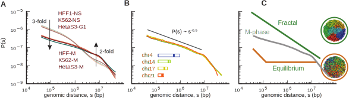
```
#### `r Citep(bib, "naumova2013organization")`
]

---
## `r icons::icon_style(icons::fontawesome("laptop-code", style = "solid"), scale = 1, fill = " #f39c12")` Contacts vs distance

### `HiCExplorer`


```bash
hicPlotDistVsCounts -m HiC_Legube_DIvA_rep1_with_1kb_0kb.mcool::/resolutions/100000 HiC_Legube_OHT_rep1_with_1kb_0kb.mcool::/resolutions/100000 -o counts_vs_dist.pdf --labels 'DIVA' 'OHT' --maxdepth 20000000 --plotsize 5 4.2
```

.center[
```{r out.width = '45%',echo=F}
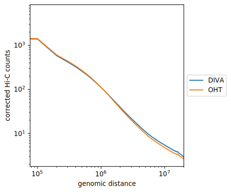
```
]

* `--outFileData`: The data underlyong the plots is saved on this file.

---
## `r icons::icon_style(icons::fontawesome("laptop-code", style = "solid"), scale = 1, fill = "#27ae60")` Genomic compartment (A/B)

__Plaid pattern__: These plaid patterns reflect tendencies of chromosome regions to make more frequent contacts with regions of the same type: active regions have increased contact frequency with other active regions, and intactive regions tend to contact other inactive regions more frequently. ([Source](https://cooltools.readthedocs.io/en/latest/notebooks/compartments_and_saddles.html))

.center[
```{r out.width = '90%',echo=F}
knitr::include_graphics("imgs/HiCImage_observed_vs_OE_vs_Pearson.svg")
```
]

* __Pearson correlation__ from __O/E__ matrix allow to see compartmentalization.
* __A__: Active (genes) chromatine associated with _euchromatin_ marks.
* __B__: Inactive chromatine associated with _heterochromatin_ marks.

---
## `r icons::icon_style(icons::fontawesome("laptop-code", style = "solid"), scale = 1, fill = "#27ae60")` Genomic compartment (A/B)

### __Eigendecomposition__ of Hi-C matrix to obtain compartment profiles: 

.center[
```{r out.width = '60%',echo=F}
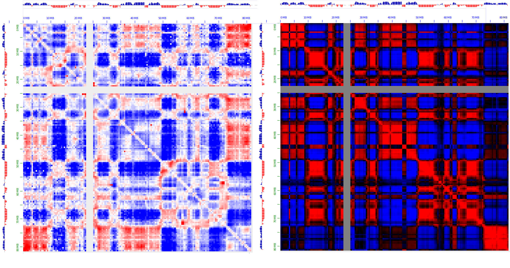
```
]


* Done by extracting first component of a __PCA__ on O/E Hi-C matrix.
* Compartment profiles from tools:
  * `eigs_cis` from `cooltools`.
  * `hicPCA` from `HiCExplorer`.
  * `eigenvector` from `juicertools`.

---
## `r icons::icon_style(icons::fontawesome("laptop-code", style = "solid"), scale = 1, fill = "#27ae60")` Genomic compartment (A/B)

### Sub-compartments

.center[
```{r out.width = '60%',echo=F}
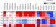
```
#### `r Citep(bib, "rao20143d")`
]


Alternatives to __Eigendecomposition__ with sub-compartment detection:

* [`CALDER`](https://github.com/CSOgroup/CALDER) (Hierarchical clustering with contact similarities).
  * Nested compartment can be associated with TADs.
* [`SNIPER`](https://github.com/ma-compbio/SNIPER) (Neural-network autoencoder).

---

## `r icons::icon_style(icons::fontawesome("laptop-code", style = "solid"), scale = 1, fill = "#27ae60")` Studying compartmentalization strenght variation

### Saddle-plots

* Stratify genomic regions using `PC1` into percentiles of similar values.
* Averaging (cis) interactions between groups from `O/E` values.

.center[
```{r out.width = '35%',echo=F}
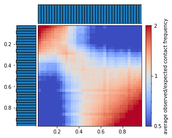
```
#### `saddleplot` function from `cooltools`
]

* `cooltools` with `saddle`.
* `FAN-C` with `fanc compartments`.
* By hand with `R`.


---

## `r icons::icon_style(icons::fontawesome("laptop-code", style = "solid"), scale = 1, fill = "#27ae60")` Topologically Associating Domains (TAD)

.center[
```{r out.width = '80%',echo=F}
knitr::include_graphics("imgs/loop_tad_ctcf_ko1.svg")
```
#### `r Citep(bib, "chang2020tads")`
]

* TAD are composed of highly self-interacting _loci_:
  * _loci_ inside a TAD interact with each other more frequently than _loci_ outside.
* TAD form 100kb~1mb interacting domains along the diagonal.
* Separated by insulated regions (CTCF binding site).

---


## `r icons::icon_style(icons::fontawesome("laptop-code", style = "solid"), scale = 1, fill = "#27ae60")` Topologically Associating Domains (TADs)

### TAD boundaries measurement on Hi-C data

__TAD boundaries__ can be measured by a TAD-separation score:
* Look at cis interactions (left/right) for a bin using a running window of different sizes.
* Different metrics can be used:
  * directionality index (_DI_) `r Citep(bib, "dixon2012topological")`.
  * insulation score `r Citep(bib, "crane2015condensin")`.
    
--

.center[
```{r out.width = '40%',echo=F}
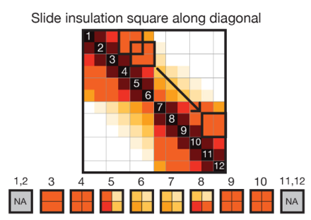
```

]

---


## `r icons::icon_style(icons::fontawesome("laptop-code", style = "solid"), scale = 1, fill = "#27ae60")` Topologically Associating Domains (TADs)

### TAD boundaries measurement on Hi-C data

__TAD boundaries__ can be measured by a TAD-separation score:
* Look at cis interactions (left/right) for a bin using a running window of different sizes.
* Different metrics can be used:
  * directionality index (_DI_) `r Citep(bib, "dixon2012topological")`.
  * insulation score `r Citep(bib, "crane2015condensin")`.
    


.center[
```{r out.width = '80%',echo=F}
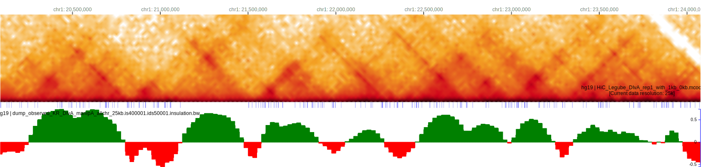
```

]

---


## `r icons::icon_style(icons::fontawesome("laptop-code", style = "solid"), scale = 1, fill = "#27ae60")` Topologically Associating Domains (TADs)

### TAD detection (TAD calling)

TAD callers:

* [TopDom](https://github.com/HenrikBengtsson/TopDom) (own score like _DI_).
* [TADtool](https://github.com/vaquerizaslab/tadtool) (_DI_ and insulation).
* [HiCExplorer](https://github.com/deeptools/HiCExplorer) (insulation).
* [cooltools](https://github.com/open2c/cooltools) (insulation).
* [TADreg](https://github.com/raphaelmourad/TADreg) (Beta from regression).
* [`Arrowhead`](https://github.com/aidenlab/juicer/wiki/Arrowhead) matrix transformation (`juicer`) .

--

.center[
```{r out.width = '55%',echo=F}
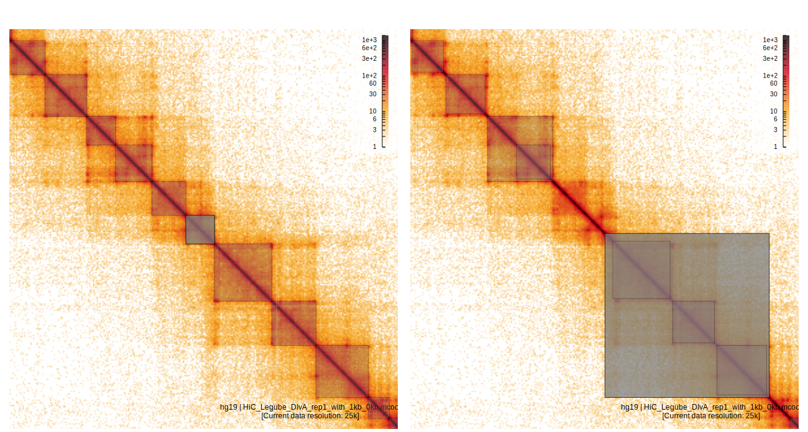
```

]


---

## `r icons::icon_style(icons::fontawesome("laptop-code", style = "solid"), scale = 1, fill = "#27ae60")` _Loop extrusion_ model

.center[
```{r out.width = '100%',echo=F,fig.cap="Mirny, L. A. (2021). Cells use loop extrusion to weave and tie the genome."}
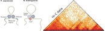
```
]

* _Loop extrusion_ promote contact between sequence that control gene expression (__enhancers__ & __promoters__).
* When a motor reels in a section of DNA that is bound to a CTCF protein, it stalls.
* The other motor can continue reeling, allowing the DNA to be scanned for regulatory sequences.


---

## `r icons::icon_style(icons::fontawesome("laptop-code", style = "solid"), scale = 1, fill = "#27ae60")` _Loop extrusion_ model

.center[
```{r out.width = '80%',echo=F,fig.cap="(Iain F. Davidson & Jan-Michael Peters, Nat Rev Mol Cell Biol (2021))."}
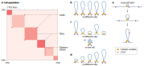
```
]

---

## `r icons::icon_style(icons::fontawesome("laptop-code", style = "solid"), scale = 1, fill = "#e74c3c")` Loop calling

.center[
```{r out.width = '80%',echo=F}
knitr::include_graphics("imgs/loop_call.svg")
```
#### `r Citep(bib, "rao20143d")`
]

* Implemented in [`HiCCUPs`](https://github.com/aidenlab/juicer/wiki/HiCCUPS).
* Other implementations are available: `cooltools.api.dotfinder`, `hicDetectLoops`.

---

## `r icons::icon_style(icons::fontawesome("laptop-code", style = "solid"), scale = 1, fill = " #e74c3c")` Aggregate analyses (APA)

### Measure enrichment of Hi-C signal for specifics features (loop, TAD boundaries, ChIP-seq peaks, ...)

.center[
```{r out.width = '80%',echo=F}
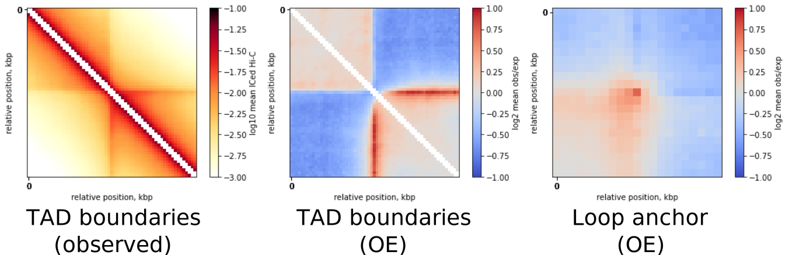
```
#### `pileup` function from `cooltools`
]

Many tools offer APA implementation :
* `FAN-C` with `fanc aggregate inter.hic TADs.bed` (`BED`/`BEDPE`)
* `cooltools` with `pileup`  (`BED`/`BEDPE`)
* `juicer-tool` with `apa inter.hic all_loops.txt` (`BEDPE`)
* `HiCExplorer` with `hicAggregateContacts`: (`BED`)
  `hicAggregateContacts --matrix inter.h5 --BED TADs.bed`


---
## `r icons::icon_style(icons::fontawesome("laptop-code", style = "solid"), scale = 1, fill = " #e74c3c")` APA with `R`

#### Load Genomic Positions `.bed`

```{r,warning=FALSE,message=F}
require(plyranges)
gamma_domains80 <- "../HiC_group_meeting_files/BLESS_80best_JunFragPE_Rmdups_pm500bp.bed" %>% 
  read_bed() %>% anchor_center() %>% mutate(width=1000000) %>% 
  filter(seqnames =="chr1")
```

#### Extract sub-matrix for each position (working with `HiTC::HTCexp` object)
.pull-left[
```{r showSparseHTC,warning=FALSE,message=F,eval=F}
extractCounts <- function(bed,HTC){
  overlaps <- findOverlaps(bed,x_intervals(HTC)) #<<
  i <- subjectHits(overlaps)
  intdata(HTC)[i,i] %>% round()
}

res.HiC <- 1:length(gamma_domains80) %>% map(function(i){
  extractCounts(gamma_domains80[i],HTC)
})

res.HiC <- res.HiC%>% plyr::compact()
res.HiC <- Reduce("+",res.HiC) #<<
colnames(res.HiC) <- rownames(res.HiC) <- 1:ncol(res.HiC)
res.HiC %>% as.matrix()
```
]

.pull-right[
```{r showSparseHTC-out,echo=F, ref.label="showSparseHTC",warning=FALSE,message=F}
```
]

#### plot heatmap with `ggplot2`

.pull-left[
```{r plot-label, eval=FALSE}
p1 <- res.HiC %>% as.matrix() %>% reshape2::melt() %>% #<<
  ggplot(aes(x=Var1,y=Var2,fill=log10(value))) + geom_tile() +
  xlab("bin2") + ylab("bin2") +theme_classic() + scale_fill_gradient(low="white",high="red")
print(p1)
```
]

.pull-right[
```{r plot-label-out, ref.label="plot-label", echo=FALSE,dev="svg",fig.height=2,fig.width=3,fig.align="center"}
```
]

---

## `r icons::icon_style(icons::fontawesome("laptop-code", style = "solid"), scale = 1, fill = " #e74c3c")` Differential APA with `R`


```{r,echo=F,warning=F,message=F}
STRAWi <- glue::glue("../HiC_group_meeting_files/straw_NONE_OHT_manipA_chr1_chr1_{binSize/1e3}kb.txt.gz")
datai <- glue::glue("zcat {STRAWi}") %>% 
  data.table::fread(sep='\t',header=F) %>% 
  as.matrix()
data.Mati<-sparseMatrix(i=(datai[,1]/binSize)+1,j=(datai[,2]/binSize)+1,x=datai[,3])
data.MatSymi<-data.Mati+t(data.Mati)
diag(data.MatSymi)<-diag(data.MatSymi)/2
rm(data.Mati,datai)
starti<-seq(1,chrendi,by=binSize)
endi<-c(seq(binSize,chrendi,by=binSize),chrendi)
chri.GR<-GRanges("chr1",IRanges(starti,endi))
names(chri.GR)<-paste0("bin",1:length(chri.GR))
HTCOHT<-HiTC::HTCexp(data.MatSymi,chri.GR,chri.GR)
```


```{r,warning=FALSE,message=F,echo=F}
res.HiC.OHT <- 1:length(gamma_domains80) %>% map(function(i){
  extractCounts(gamma_domains80[i],HTCOHT)
})

res.HiC.OHT <- res.HiC.OHT%>% plyr::compact()
res.HiC.OHT <- Reduce("+",res.HiC.OHT) 
colnames(res.HiC.OHT) <- rownames(res.HiC.OHT) <- 1:ncol(res.HiC.OHT)
```

```{r}
DiffOHTDIVA <- log2(res.HiC.OHT/res.HiC) %>% #<<  
  as.matrix() %>% reshape2::melt()
```


.pull-left[

```{r,diffheatmap,eval=F}
maxval <- max(DiffOHTDIVA$value)
p2 <- DiffOHTDIVA %>%
  ggplot(aes(x=Var1,y=Var2,fill=value)) +
  geom_tile() +
  xlab("bin2") + ylab("bin2") +theme_classic() +
  scale_fill_gradient2(low="blue",mid = "black",high="yellow",midpoint = 0,limits = c(-maxval,maxval))
print(p2)

```
]
.pull-right[
```{r, echo=F, ref.label="diffheatmap",dev="svg",fig.height=4,fig.width=5,fig.align="center"}

```

]


---
## `r icons::icon_style(icons::fontawesome("laptop-code", style = "solid"), scale = 1, fill = " #e74c3c")` APA with `R`

### Using `InteractionSet` classe

```{r,warning=FALSE,message=FALSE,fig.align="center",fig.height=5,fig.width=8,dev="svg"}

res_sub_hic <- 1:length(gamma_domains80) %>% map(function(i){
  startpos <- my.ranges %>% filter_by_overlaps(gamma_domains80[i]) %>% as_tibble() %>% slice(1) %>% pull(start)
  
  out <- linkOverlaps(iset, gamma_domains80[i]) 
  
  siset <- iset[out$query]
  cbind(pos1=(start(anchors(siset)$first)-startpos+1),
        pos2=(start(anchors(siset)$second)-startpos+1),
        assay(siset))  %>% as_tibble()
}) %>% setNames(gamma_domains80$name) %>% bind_rows(.id="DSB")

res_sub_hic <- res_sub_hic %>%
  gather(key=Condition,value=value,-DSB:-pos2) %>% 
  group_by(pos1,pos2,Condition) %>% summarise(value = sum(value)) #<<

```


.pull-left[

```{r, echo=F,dev="svg",fig.height=2,fig.width=4,fig.align="center"}
p3 <- res_sub_hic %>% 
  ggplot(aes(x=pos1,y=pos2,fill=log10(value))) + geom_tile() +
  xlab("bin2") + ylab("bin2") +theme_classic() + scale_fill_gradient(low="white",high="red") +facet_grid(~Condition) + theme(axis.ticks = element_blank(),axis.text = element_blank())
print(p3)
```

]
--

.pull-right[

```{r,eval=F}
res_sub_hic_2 <- rbind(
  res_sub_hic,
  res_sub_hic %>% filter(pos1!=pos2) %>% dplyr::rename("pos3"=pos2) %>% dplyr::rename("pos1"=pos3,"pos2"=pos1)
) 


```

```{r, echo=F,dev="svg",fig.height=2,fig.width=4,fig.align="center"}

res_sub_hic_2 <- rbind(
  res_sub_hic,
  res_sub_hic %>% filter(pos1!=pos2) %>% dplyr::rename("pos3"=pos2) %>% dplyr::rename("pos1"=pos3,"pos2"=pos1)
) 

p4 <- res_sub_hic_2 %>% 
  ggplot(aes(x=pos1,y=pos2,fill=log10(value))) + geom_tile() +
  xlab("bin2") + ylab("bin2") +theme_classic() + scale_fill_gradient(low="white",high="red")+facet_grid(~Condition) +theme(axis.ticks = element_blank(),axis.text = element_blank())
print(p4)
```

]


---

# References

```{r, results='asis', echo=FALSE}
PrintBibliography(bib,end = 5)
```

---

# References

```{r, results='asis', echo=FALSE}
PrintBibliography(bib,start=6,end=11)
```

---

# References

```{r, results='asis', echo=FALSE}
PrintBibliography(bib,start=12)
```